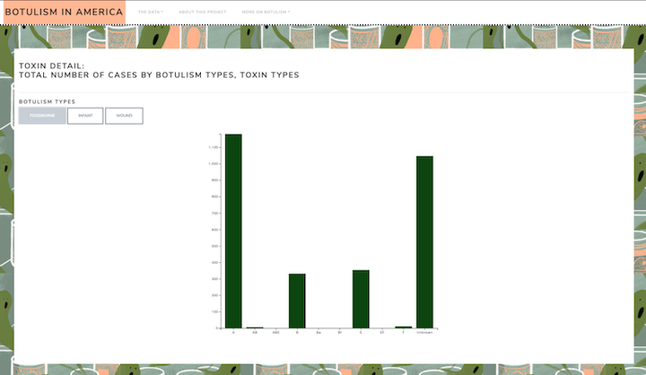
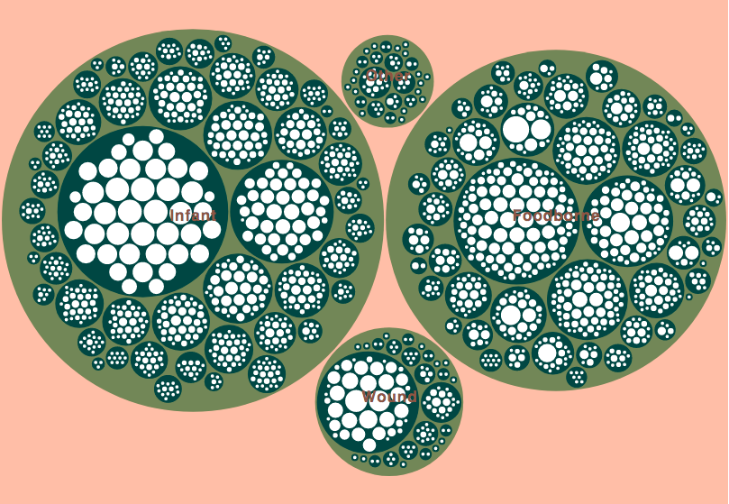
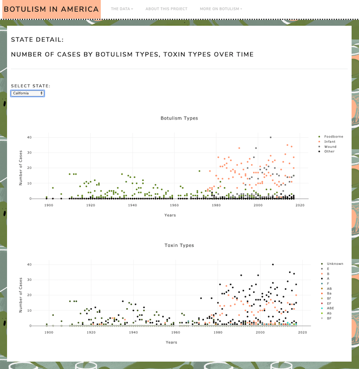

# A Look at Botulism Through History

This project uses historical data from the Centers for Disease Control and Prevention (https://www.cdc.gov/botulism/index.html) to explore trends in Botulism in the United States since 1897. 

After initial exploration, analysis, and cleanup of the raw data using Jupyter Notebook, all of the data was pulled into a SQLite database due to the overall portability and easy accessibility of SQLite via Flask app. In Flask, we created multiple routes to serve up each of the JSONs needed for our analysis. We used D3, Plotly, and Observable to create dynamic visualizations into which we fed the JSON and CSV data. To style our HTML, we used a free Bootstrap theme called Lux, customized to fit our needs.

In addition to the data visualizations, this web page also provides:
* A full view of all of the raw data
* Details about how the data was cleaned
* Information about the history of botulism, each of its types and toxins, and safety and prevention tips

### TOXIN DETAIL: TOTAL NUMBER OF CASES BY BOTULISM TYPES, TOXIN TYPES

This first visualization is a dynamic bar chart that shows the total number of cases of botulism since 1897 broken down by botulism type (select one: foodborne, infant, or wound) and toxin type. 

### TYPES OF BOTULISM BY STATE AND YEAR

Using D3 and Observable, this dynamic visualization displays the number of cases of each type of botulism by state and by year. It allows the user to drill down into the data and explore how the number of cases varies across type, state, and year. The largest circles (light green) represent the types of botulism: foodborne, infant, wound, or other. The next larges circles (dark green) represent each state. The smallest circles (white) represent the years. The size of each circle is equal to the number of cases that circle represents.

### STATE DETAIL: NUMBER OF CASES BY BOTULISM TYPES, TOXIN TYPES OVER TIME

These final visualizations let the user drill down into the data by state to discover how many cases there were of each botulism type and each toxin type over the years. You can see the breakdown of the number of cases for each type by hovering over each year on the charts.

## Deployment
1. Clone this repository, making sure all file structures remain the same
2. Run the Flask app to activate LocalHost
3. Open your LocalHost server to view the data
